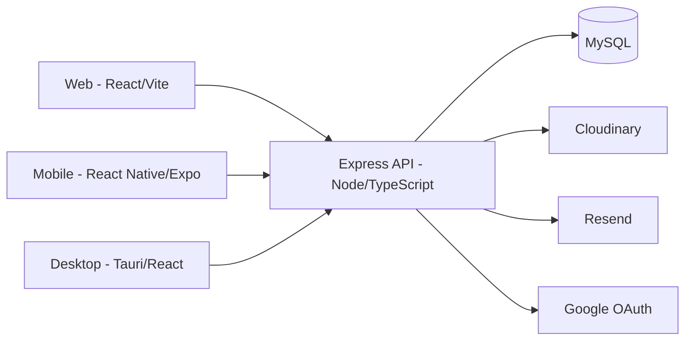

# Eclipse Player

A music streaming platform I designed and built solo, end to end: REST API, web app, mobile app and desktop app. It is live at **[eclipseplayer.com](https://eclipseplayer.com/)** with 50+ real users.

<!-- TODO: add 3-4 screenshots (player, library, stats dashboard, mobile) and one short GIF of the player here -->

## Platforms

| Platform | Stack | Hosting / status |
|---|---|---|
| Server | Node.js, Express, TypeScript, MySQL | Railway |
| Web | React, Vite, TypeScript | Netlify |
| Mobile | React Native, Expo | Android build (APK) |
| Desktop | Tauri, React, TypeScript | In development |

## Features

- **Authentication and roles:** JWT auth with protected routes, role-based access (premium / private users), Google sign-in on web, desktop and mobile.
- **Streaming player:** persistent playback while navigating, mini player, playlists, albums and library.
- **Play tracking and statistics:** every play is recorded; a personal stats dashboard shows listening history with range selectors and automatic granularity (recharts on web, a custom bar chart on mobile). Admins get per-song stats on web.
- **Media pipeline:** Cloudinary for media storage and delivery.
- **Email:** transactional emails (password reset) through Resend.
- **Password reset and account security:** hashed reset tokens consumed in an atomic SQL transaction.

## Architecture



The backend is organised by domain. Each request goes through **Controller → Service → Repository**, and every domain's repository owns its own queries, with no cross-domain repository imports. On the clients, services are split into `GetService`, `PostService`, `PutService` and `DeleteService`, on both web and mobile.

## Engineering decisions

- **Strict domain isolation** on the backend, so a change in one domain (playlists, plays, users) can't silently reach into another.
- **TypeScript with `strict: true`** across backend and web, after migrating both from JavaScript.
- **Security review of the whole backend**, including: constant-time handling of unknown users on login (`DUMMY_HASH`) to prevent timing attacks, atomic consumption of password-reset tokens, HTML-injection protection in email templates, path-traversal protection on the APK download endpoint, and validated, human-readable HTTP errors.
- **Desktop OAuth:** Tauri's WebView blocks OAuth popups and Google no longer allows custom URI redirects, so the desktop app starts a loopback server in Rust, opens the system browser, and exchanges the authorization code server-side through a dedicated endpoint.
- **Play-record persistence:** `localStorage` on web, a polling-based equivalent on mobile.
- **Tests:** unit tests with Vitest and React Testing Library on the web client, starting with pure utilities.

## Running locally

Requirements: Node.js and a running MySQL instance.

Each part has its own `.env`. Variable names only; fill in your own values.

**server/.env**

```
MYSQL_HOST=
MYSQL_USER=
MYSQL_PASSWORD=
MYSQL_DATABASE=
MYSQL_PORT=
JWT_SECRET=
RESET_PASSWORD_SECRET=
PORT=
NODE_ENV=
CLIENT_ORIGINS=
FRONTEND_URL=
CLOUDINARY_BASE_URL=
EMAIL_USER=
EMAIL_PASS=
RESEND_API_KEY=
GOOGLE_CLIENT_ID_WEB=
GOOGLE_CLIENT_ID_DESKTOP=
GOOGLE_CLIENT_SECRET_DESKTOP=
GOOGLE_CLIENT_ID_ANDROID=
GOOGLE_CLIENT_ID_IOS=
DUMMY_HASH=
```

**client/.env**

```
VITE_API_URL=
VITE_GOOGLE_CLIENT_ID=
VITE_CURRENT_APK_VERSION=
VITE_CURRENT_DESKTOP_VERSION=
```

**desktop/.env**

```
VITE_API_URL=
VITE_GOOGLE_CLIENT_ID=
VITE_CURRENT_APK_VERSION=
```

**mobile/.env**

```
API_URL=
```

Install dependencies with `npm install` in each folder, then:

| Part | Command |
|---|---|
| Server | `npm run dev` (production: `npm run build`, then `npm start`) |
| Web client | `npm run dev` (tests: `npm test`) |
| Mobile | `npm start` (or `npm run android` / `npm run ios`) |
| Desktop | `npm run tauri dev` |

## Roadmap

- Mobile equalizer
- Finish the desktop app
- Error-logging table for application errors

## Author

George Tzachristas, full-stack developer based in Ioannina, Greece.
[GitHub](https://github.com/GeorgeTza90) · [LinkedIn](https://www.linkedin.com/in/george-tzachristas)
